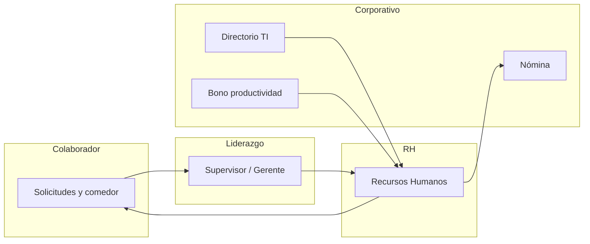
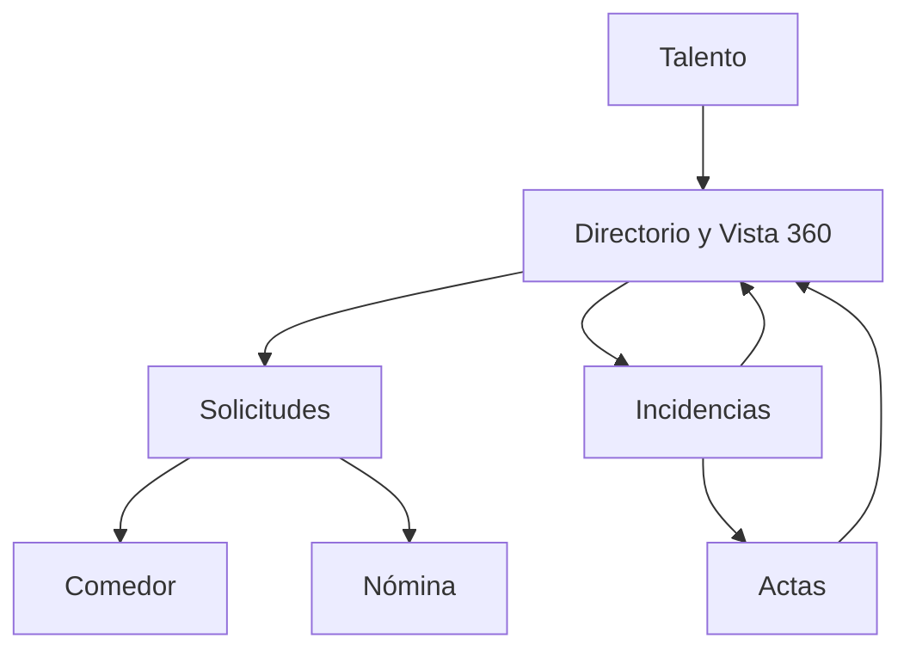

# Documentación Ejecutiva — Plataforma RH Leoni

**Audiencia:** Dirección, gerencia y líderes de área  
**Alcance:** Operación de planta Leoni Cable en México  
**Versión del documento:** Mayo 2026  

---

## Resumen Ejecutivo

### Qué es el proyecto

La **Plataforma RH Leoni** es el sistema corporativo de Recursos Humanos para la operación en México. Centraliza en un solo entorno digital la gestión de asuntos laborales, control de comedor, desarrollo de talento y la consulta integral de cada colaborador. Está pensada para uso en planta y oficinas, con acceso según el rol de cada persona.

### Objetivo general

Digitalizar y estandarizar los procesos de RH que hoy se dispersan entre formatos, correos y sistemas aislados, de modo que colaboradores, supervisores y Recursos Humanos trabajen sobre la misma información, con trazabilidad, notificaciones y reportes para la toma de decisiones.

### Problemas que resuelve

| Problema | Cómo lo aborda la plataforma |
|----------|------------------------------|
| Solicitudes de permisos y vacaciones sin seguimiento claro | Registro único, flujo de aprobación por jerarquía y registro automático en nómina al aprobar |
| Incidencias laborales en hojas o correos | Expediente digital por colaborador, con evidencias y vínculo a actas administrativas |
| Comedor sin visibilidad de demanda ni control de acceso | Reservas semanales, menú publicado, acceso en torniquete y reportes de asistencia |
| Información del empleado fragmentada | Vista 360 con historial, métricas, actas, comedor y saldo de vacaciones en un solo perfil |
| Brechas de competencias difíciles de medir | Matriz por área y puesto, evaluaciones por competencia y catálogo de capacitaciones |
| Retrasos al reflejar movimientos en nómina | Cola de sincronización con el sistema de nómina tras cada aprobación relevante |
| Directorio desactualizado | Sincronización periódica con el sistema maestro de personal de TI |

### Beneficios para la organización

- **Menos fricción operativa:** el colaborador solicita, el líder aprueba y RH supervisa desde el mismo lugar.
- **Mayor cumplimiento:** actas con fundamento legal documentado, firmas de roles clave y respaldo de evidencias en incidencias.
- **Mejor planeación:** tableros y métricas de solicitudes, incidencias, actas, plantilla y comedor.
- **Experiencia del colaborador:** autoservicio para solicitudes, reservas de comedor y consulta de capacitaciones.
- **Base para el desarrollo del talento:** perfiles de puesto, competencias y evaluaciones alineados a la operación cableera.

### Impacto esperado en la operación

- Reducción de tiempos de respuesta en permisos y vacaciones.
- Visibilidad en tiempo casi real de retardos, faltas e incidencias de calidad y seguridad (incluidas las importadas del sistema de bono de productividad).
- Control del beneficio de comedor y proyección de demanda por semana.
- Decisiones de capacitación y sucesión apoyadas en datos de competencias y brechas, a medida que se consolida el módulo de talento.

---

## Visión General del Sistema

### Cómo funciona el sistema a nivel general

La plataforma se organiza en **módulos de negocio** accesibles desde un menú lateral según el rol del usuario. Tras iniciar sesión, cada persona ve un **tablero principal** adaptado a su función: el colaborador consulta sus pendientes; el supervisor o gerente ve el equipo; Recursos Humanos y gerencia ven indicadores globales y analítica por periodo (7, 30 o 90 días).

Los procesos siguen un patrón común: **captura → revisión por jerarquía o RH → notificación → registro en expediente** y, cuando aplica, **envío al sistema de nómina** o **actualización del perfil del colaborador**.

### Quiénes son los usuarios involucrados

| Rol | Perfil | Acceso principal |
|-----|--------|------------------|
| **Colaborador** | Personal operativo y administrativo | Solicitudes propias, reserva de comedor, capacitaciones asignadas, notificaciones |
| **Supervisor** | Jefe directo de línea | Aprobación de solicitudes del equipo, incidencias, evaluaciones, vista de comedor del equipo; sin actas ni reporte global de comedor |
| **Gerente** | Responsable de área o subárbol | Igual que supervisor, más métricas laborales y reporte de comedor |
| **Director** | Dirección de área | Módulos de talento (perfiles, competencias, evaluaciones, formación en diseño) y visión ampliada |
| **Recursos Humanos** | Administración de personal | Configuración completa, actas, directorio, comedores, sincronizaciones y analítica |

### Cómo interactúan las distintas áreas

- **Producción y líderes** registran o consultan incidencias y aprueban ausencias.
- **RH** valida casos especiales, genera actas, administra comedor y plantilla.
- **TI** alimenta el directorio de empleados; la plataforma no sustituye ese maestro, lo refleja.
- **Nómina** recibe los movimientos aprobados (vacaciones, home office, permisos con y sin goce, etc.).
- **Bono de productividad** aporta incidencias históricas de calidad, seguridad y evaluación que se incorporan al expediente.

### Qué valor genera para la empresa

Una **gestión integral del ciclo del colaborador**: desde su ingreso en el directorio, pasando por permisos e incidencias, beneficio de comedor, desarrollo por competencias y, cuando el proceso lo exige, acta administrativa formal — todo consultable en la vista 360.

---

## Módulo: Laborales

Agrupa los procesos relacionados con la relación laboral cotidiana: ausencias, disciplina, métricas y cumplimiento documental.

### Métricas

#### Objetivo del módulo

Ofrecer a Recursos Humanos y gerencia una **vista analítica unificada** de solicitudes e incidencias, con filtros por periodo, área y colaborador, para detectar tendencias y focalizar acciones correctivas.

#### Descripción funcional

Pantalla de analítica que combina gráficas de solicitudes (por tipo, estado, área) e incidencias (distribución por tipo, tendencia, ranking de retardos). Disponible para roles **RH** y **gerente**.

#### Procesos que administra

- Consulta agregada de solicitudes e incidencias en un rango de fechas.
- Cruce de filtros (tipo, área, supervisor, empleado).
- Visualización de tendencias y concentración por tipo de incidencia.

#### Información que gestiona

- Volúmenes y estados de solicitudes.
- Conteos y clasificación de incidencias.
- Rankings de colaboradores con mayor incidencia de retardo en el periodo seleccionado.

#### Beneficios para colaboradores

Indirectos: procesos más transparentes al contar con datos objetivos para políticas de asistencia.

#### Beneficios para líderes y gerencia

- Identificación rápida de áreas o equipos con mayor presión operativa (retardos, faltas, calidad, seguridad).
- Soporte para reuniones de seguimiento con datos actualizados.

#### Casos de uso principales

- Revisión semanal de retardos por área.
- Análisis mensual de solicitudes pendientes o con cambios solicitados.
- Comparación de incidencias de calidad y seguridad tras importación nocturna.

#### Valor estratégico para la organización

Convierte el expediente laboral en **inteligencia operativa**, no solo en archivo.

---

### Solicitudes

#### Objetivo del módulo

Gestionar de punta a punta las **solicitudes de ausencia y permisos** del personal, con reglas de aprobación jerárquica y reflejo en nómina.

#### Descripción funcional

Los colaboradores (o sus líderes en su nombre) capturan solicitudes con fechas de inicio y fin. El sistema valida duplicados y empalmes de fechas. El flujo pasa por el **supervisor directo** y, según el caso, por **gerente** y **RH**, con estados: pendiente, aprobada, rechazada, cancelada, con cambios solicitados o anulada por override de RH.

Al aprobar, las solicitudes elegibles se **encolan para el sistema de nómina** (vacaciones, home office, matrimonio, incapacidad interna, defunción, paternidad, permiso sin goce de sueldo). Si se aprueban vacaciones, las **reservas de comedor pendientes** en ese rango pueden cancelarse automáticamente.

#### Procesos que administra

| Tipo de solicitud | Uso típico |
|-------------------|------------|
| Vacaciones | Periodos de descanso programados |
| Home office | Trabajo remoto autorizado |
| Matrimonio | Permiso con goce por matrimonio |
| Incapacidad interna | Ausencia por incapacidad reconocida internamente |
| Defunción | Permiso por fallecimiento de familiar |
| Paternidad | Permiso por nacimiento |
| Permiso sin goce de sueldo | Ausencia sin pago (motivo obligatorio) |

Acciones del flujo: crear, enviar, aprobar, rechazar, solicitar cambios, revisión, anulación (override RH), cancelar.

#### Información que gestiona

- Colaborador, tipo, fechas, motivo, comentarios, estado, nivel de aprobación, historial de aprobaciones.
- Notificaciones al colaborador y al líder cuando hay movimiento.

#### Beneficios para colaboradores

- Trámite en línea con seguimiento del estado.
- Notificación cuando la solicitud es enviada, aprobada o rechazada.

#### Beneficios para líderes y gerencia

- Bandeja del equipo con calendario y detalle por solicitud.
- Imposibilidad de autoaprobar solicitudes propias en rol jerárquico.
- RH puede actuar sobre todo el catálogo y corregir excepciones.

#### Casos de uso principales

- Colaborador solicita vacaciones; supervisor aprueba; RH valida si aplica; nómina recibe el registro.
- RH registra permiso con goce por matrimonio para un operador.
- Gerente rechaza home office por cobertura de línea.

#### Valor estratégico para la organización

Estandariza la política de ausencias y **elimina reprocesos** entre RH y nómina.

---

### Incidencias

#### Objetivo del módulo

Registrar y consultar **eventos de disciplina, asistencia, calidad y seguridad** vinculados a cada colaborador, con evidencias adjuntas.

#### Descripción funcional

Recursos Humanos, gerentes, supervisores y dirección pueden listar y filtrar incidencias. RH crea incidencias manuales; el sistema también recibe registros con origen **automático desde bono de productividad** (calidad, seguridad, evaluación general, importaciones históricas programadas por la noche).

Tipos reconocidos en la operación incluyen, entre otros: **retardo**, **falta injustificada**, **falta justificada**, **indisciplina**, **daño a equipo**, **seguridad**, **calidad**, **evaluación**, permisos y vacaciones reflejadas como incidencia, etc.

Al crear una incidencia, el colaborador afectado recibe **notificación en plataforma**.

#### Procesos que administra

- Alta y consulta de incidencias.
- Adjuntar y eliminar evidencias (documentos vinculados a la incidencia o al acta).
- Estadísticas agregadas para tableros y vista 360.
- Sincronización de lote desde bono de productividad (RH).

#### Información que gestiona

- Empleado, tipo, fecha, área, subárea, categoría, detalle, origen (manual o bono), estatus.
- Conteo de evidencias por registro.

#### Beneficios para colaboradores

- Visibilidad de lo registrado en su expediente (según permisos).
- Alerta cuando se registra una nueva incidencia.

#### Beneficios para líderes y gerencia

- Historial del equipo para coaching y acciones correctivas.
- Exportación a hoja de cálculo para auditorías o reuniones.

#### Casos de uso principales

- Supervisor documenta retardo reiterado con evidencia.
- RH importa incidencias de seguridad del turno anterior desde bono.
- Gerente analiza concentración de incidencias de calidad por área.

#### Valor estratégico para la organización

Unifica **asistencia, disciplina y desempeño en planta** en un solo expediente trazable.

---

### Actas administrativas

#### Objetivo del módulo

Formalizar situaciones disciplinarias mediante **actas administrativas** con fundamento legal, descripción de hechos, firmas y documento PDF.

#### Descripción funcional

Recursos Humanos crea actas (manualmente o generadas a partir de una incidencia). El formulario incluye tipo de falta, fundamento (Ley Federal del Trabajo o Reglamento Interior de Trabajo), hechos, testigos, lugar, fecha del evento y responsable de RH.

La plataforma ofrece **recomendaciones de redacción legal** asistidas por inteligencia artificial, validadas contra documentación interna de referencia. El acta avanza por estados hasta quedar **firmada** por los roles requeridos (**gerente, director y RH**). Se puede editar, anular, aprobar y descargar PDF.

Los supervisores **no tienen acceso** al módulo de actas (restricción de negocio).

#### Procesos que administra

- Creación y edición de actas.
- Generación sugerida desde incidencia.
- Mejora de texto con asistente legal.
- Flujo de firmas y aprobación.
- Anulación con motivo.
- Métricas de actas en proceso y pendientes de firma (tablero RH).

#### Información que gestiona

- Datos del colaborador, hechos, marco legal, evidencia citada, firmantes, timestamps, estado.

#### Beneficios para colaboradores

- Proceso documentado y con espacio para manifestación (según formato del acta).
- Mayor claridad del fundamento legal.

#### Beneficios para líderes y gerencia

- Gerente y director participan en la cadena de firma.
- RH controla calidad y consistencia de la documentación.

#### Casos de uso principales

- RH levanta acta por daño a equipo tras incidencia registrada.
- Director firma acta pendiente en bandeja.
- Exportación de listado de actas para archivo legal.

#### Valor estratégico para la organización

Reduce riesgo laboral por **documentación incompleta** y acelera la producción de actas consistentes.

---

## Módulo: Comedor

### Objetivo del módulo

Administrar el **beneficio de comedor**: menú semanal, reservas de acceso, control en torniquete o terminal, operación para líderes de equipo y reportería para RH y gerencia.

### Descripción funcional

El módulo se divide en:

1. **Gestión de comedor (colaborador y líderes):** calendario semanal para reservar día y tipo de platillo (normal o dieta), consulta de próximas reservas y, para supervisores/gerentes, vista del equipo y beneficiarios.
2. **Operación en sitio:** validación de huella y registro de consumo en terminal de acceso (personal autorizado en planta).
3. **Administración RH:** alta de comedores, publicación de menú, registro manual de accesos, códigos externos, resumen diario y proyecciones de demanda.
4. **Reporte de comedor:** tablero y exportación para RH, gerente y director (supervisor excluido).

Al aprobar **vacaciones**, las reservas de comedor del colaborador en esas fechas pueden darse de baja automáticamente.

### Procesos que administra

- Reserva y cancelación de accesos por semana.
- Publicación de menú por comedor y fecha.
- Consumo efectivo en torniquete (acceso / consumo).
- Registros RH y reportes de asistencia futura por semana.
- Estadísticas y proyecciones para planeación de alimentos.

### Información que gestiona

- Comedores activos, menú, reservas, asistencia real, turno de comedor del colaborador (visible en vista 360 para RH).
- Correlativos para personal externo cuando aplica.

### Beneficios para colaboradores

- Autoservicio de reserva con visibilidad de días ocupados.
- Menú consultable por semana.

### Beneficios para líderes y gerencia

- Seguimiento de reservas del equipo.
- Métricas de uso sin acceder al reporte corporativo completo (según rol).

### Casos de uso principales

- Operador reserva comedor para la semana siguiente.
- RH publica menú y revisa proyección vs. asistencia.
- Planta valida huella en acceso al comedor.
- Gerente descarga reporte mensual de asistencia.

### Valor estratégico para la organización

Optimiza costo y desperdicio de alimentación y asegura que el beneficio se use **solo por quien tiene reserva válida**.

---

## Módulo: Talento

Concentra la configuración y seguimiento del **desarrollo de personas**: qué se espera por puesto, qué competencias se miden, qué capacitaciones existen y cómo se evalúa el desempeño por competencia. Acceso principal: **RH, director y gerente** (según pantalla).

### Perfiles de puesto

#### Objetivo

Definir **qué perfil corresponde a cada puesto o familia de puestos** (requisitos, competencias asociadas, personas asignadas) como base del resto del módulo.

#### Descripción funcional

Listado en tarjetas con indicadores de cumplimiento y brechas. Alta, edición y baja de perfiles; detalle por perfil con empleados vinculados. Integración prevista con **perfil de funciones** corporativo (formulario digital del puesto).

#### Procesos

- CRUD de perfiles de puesto.
- Consulta de empleados por perfil.
- Visualización de brechas agregadas.

#### Información

- Nombre, área, nivel, requisitos, competencias requeridas, métricas de cobertura.

#### Beneficios

| Audiencia | Beneficio |
|-----------|-----------|
| Colaboradores | Claridad de expectativas del puesto (vía evaluaciones y 360 en evolución) |
| Líderes / gerencia | Saber qué perfiles tienen más brechas |
| Organización | Base para sucesión y reclutamiento interno |

#### Casos de uso

- RH crea perfil “Operador de crimpado” y asocia competencias.
- Gerente revisa % de cumplimiento del área Cableado.

#### Valor estratégico

Alinea **estándares de puesto** con la operación real de Leoni Cable.

---

### Matriz de competencias

#### Objetivo

Configurar el **nivel de competencia esperado por puesto y área** y detectar brechas críticas.

#### Descripción funcional

Matriz editable por área: competencias en filas, puestos en columnas, niveles requeridos. Vista de brechas y mantenimiento del catálogo de competencias.

#### Procesos

- Definición de competencias y niveles en matriz.
- Análisis de brechas (gaps).
- Actualización masiva de celdas.

#### Información

- Competencia, puesto, nivel requerido (escala 0–4), área.

#### Beneficios

- RH prioriza planes de capacitación.
- Supervisores evalúan contra el mismo estándar.

#### Casos de uso

- Actualizar nivel requerido de “Lectura de plano” para inspectores.
- Identificar gaps críticos antes de auditoría de cliente.

#### Valor estratégico

Lenguaje común de **habilidades medibles** en toda la planta.

---

### Catálogo de tareas

#### Objetivo

Mantener el **catálogo corporativo de tareas** que alimentan los perfiles de funciones y la descripción de puestos.

#### Descripción funcional

Listado de tareas con categoría y marca de tarea complementaria. Alta desde la plataforma (RH).

#### Procesos

- Registro y edición de tareas estándar.

#### Información

- Nombre, categoría, indicador de complementaria.

#### Beneficios

- Estandarización de verbos y actividades en perfiles.
- Menos ambigüedad entre áreas.

#### Casos de uso

- RH agrega tarea “Inspección IPC-A-620” al catálogo.
- Vinculación posterior al perfil de funciones del puesto.

#### Valor estratégico

Puente entre **operación en piso** y documentación formal del puesto.

---

### Evaluaciones

#### Objetivo

Registrar **evaluaciones de competencias por colaborador** frente al estándar del puesto o área.

#### Descripción funcional

Listado filtrable por área, empleado y competencia. RH y supervisores crean evaluaciones con nivel actual (escala 0–4: sin evidencia, básico, intermedio, avanzado, experto) y observaciones. Vista resumen por empleado con barras de progreso vs. nivel requerido.

#### Procesos

- Crear, actualizar y eliminar evaluaciones.
- Consultar resumen por colaborador.

#### Información

- Empleado, competencia, nivel actual, evaluador, fecha, observaciones.

#### Beneficios

| Audiencia | Beneficio |
|-----------|-----------|
| Colaboradores | Retroalimentación estructurada |
| Líderes | Evaluación homogénea del equipo |
| RH | Histórico para decisiones de desarrollo |

#### Casos de uso

- Supervisor evalúa nivel de “Crimpado manual” tras certificación en piso.
- RH revisa colaboradores bajo umbral en competencia crítica.

#### Valor estratégico

Cierra el ciclo **definir → medir → actuar** sobre competencias.

---

### Capacitaciones

#### Objetivo

Gestionar el **catálogo de cursos** y las **inscripciones** del personal.

#### Descripción funcional

RH administra capacitaciones (nombre, duración, modalidad presencial/online/mixta, instructor, fechas, cupo, área, competencias asociadas, estado). Los colaboradores consultan catálogo, se inscriben o cancelan inscripción y ven **mis inscripciones**. La pantalla incluye además vistas de demostración para asignaciones masivas (en consolidación).

#### Procesos

- CRUD de capacitaciones (RH).
- Inscripción y cancelación (colaborador).
- Consulta de inscripciones propias.

#### Información

- Curso, modalidad, cupo, inscripciones por estado (inscrito, en curso, completado, cancelado).

#### Beneficios

- Colaborador: oferta visible y autogestión de inscripción.
- RH: control de cupos y vigencia de cursos.

#### Casos de uso

- RH publica curso de LOTO; operadores se inscriben.
- Colaborador cancela inscripción por cambio de turno.

#### Valor estratégico

Centraliza la **oferta formativa** ligada a competencias del negocio.

---

### Formación y cumplimiento (Level Up) — en evolución

Bajo el menú **Talento → Formación** y **Cumplimiento** existen pantallas de **Level Up**: matrices de capacidades y habilidades, manejo de cursos y OPLs, motor de evidencias, sugerencias de capacitación y encuestas post curso.

**Estado actual:** la mayoría de estas pantallas operan como **prototipo de negocio** (datos de demostración en interfaz). El catálogo de **habilidades** sí cuenta con registro administrativo en backend (alta/listado para RH). El resto está planificado para integrarse con capacitaciones, evaluaciones y expediente del colaborador.

#### Objetivo (diseño)

Gestionar el ciclo **capacitar → acreditar con evidencia → medir satisfacción → sugerir siguiente paso**.

#### Valor estratégico (futuro)

Polivalencia en líneas de cableado, trazabilidad para auditorías de cliente (IATF, IPC) y reducción de riesgo en puestos críticos.

---

## Módulo: Empleados 360

### Objetivo del módulo

Ofrecer una **vista única del colaborador** para líderes y RH: datos de identidad y puesto, actividad reciente, métricas de incidencias, expediente tabulado y accesos rápidos.

### Descripción funcional

Desde el **directorio de empleados** se abre la ficha 360 con pestañas:

| Pestaña | Contenido |
|---------|-----------|
| **Resumen** | Línea de tiempo de solicitudes, incidencias y actas recientes; competencias resumidas |
| **Incidencias** | Tabla paginada del expediente |
| **Historial** | Solicitudes y actas firmadas |
| **Beneficios** | Saldo de días de vacaciones (registro en plataforma; integración completa con nómina en evolución) |
| **Capacidades** | Vista de brechas vs. requerido (demostración; enlace a matriz de capacidades) |
| **Plan de desarrollo** | Ruta sugerida de cursos (demostración) |
| **Actas** | Listado de actas del colaborador |
| **Registros comedor** | Historial de reservas y consumo |

RH puede editar asignación organizativa desde acciones de la ficha. Métricas de retardos y faltas justificadas se muestran en tarjetas para RH.

### Procesos que administra

- Consulta integral (lectura).
- Edición de asignación (RH).
- Navegación a evaluación o matrices relacionadas.

### Información que gestiona

- Datos personales y laborales, líder, área, puesto, estado, antigüedad, foto.
- Agregados de solicitudes, incidencias, actas, vacaciones, comedor, turno de comedor.

### Beneficios para colaboradores

- Mayor transparencia cuando se habiliten vistas propias ampliadas (hoy el foco es líder/RH).

### Beneficios para líderes y gerencia

- Una sola pantalla antes de una conversación de desempeño o disciplina.
- Menos tiempo buscando en correos o archivos.

### Casos de uso principales

- RH prepara reunión de caso: abre 360, revisa incidencias y actas.
- Supervisor verifica saldo de vacaciones antes de aprobar solicitud.
- Gerente exporta contexto del equipo desde directorio.

### Valor estratégico para la organización

Materializa el concepto de **“expediente digital del colaborador”** para decisiones rápidas y consistentes.

---

## Módulos adicionales

### Dashboard (tablero principal)

Vista inicial según rol:

- **Colaborador:** calendario de solicitudes y accesos rápidos.
- **Supervisor / gerente:** calendario del equipo, gráficas de incidencias y home office por día.
- **RH / gerencia:** KPIs globales (empleados activos, solicitudes por estado, incidencias, actas pendientes de firma), analítica laboral y de comedor por periodo, gráficas de plantilla (áreas, puestos, antigüedad).

### Directorio de empleados

Listado filtrable por área, puesto, estado, búsqueda; resumen de plantilla (activos, sin líder, sin correo, contratos por vencer). Exportación a Excel para RH. Acceso: supervisor, gerente, director y RH (alcance de datos según rol).

### Notificaciones

Centro de avisos **en plataforma** y envío opcional por **correo** ante eventos (solicitudes, incidencias, actas, etc.). Contador de no leídas en barra superior; marcar leída o todas leídas.

### Organigrama

Visualización jerárquica de la organización (árbol, búsqueda, filtros por departamento y profundidad). Disponible para RH; entrada de menú puede estar oculta pero la funcionalidad existe para consulta administrativa.

### Administración de usuarios

RH gestiona cuentas, roles y datos de acceso vinculados al empleado (módulo de usuarios, complemento al directorio).

### Sincronización con sistemas corporativos (procesos en segundo plano)

| Integración | Propósito de negocio |
|-------------|----------------------|
| **Directorio TI** | Mantener empleados y catálogos alineados al sistema maestro; cancelar solicitudes pendientes si el colaborador deja de estar activo |
| **Nómina (TRESS)** | Tras aprobar solicitudes, registrar movimientos sin captura manual duplicada |
| **Bono de productividad** | Incorporar incidencias históricas de calidad, seguridad, importadas y evaluación; sincronizar datos de empleados según configuración |

---

## Integración de Procesos

Los módulos no operan aislados; forman un **flujo de vida laboral**:

1. **Alta y datos base:** el directorio TI alimenta empleados y líderes → el directorio RH los presenta y abre la vista 360.
2. **Operación diaria:** asistencia e incidencias (manual o bono) → si procede, acta administrativa → notificación al colaborador.
3. **Ausencias:** solicitud → aprobación jerárquica → nómina + ajuste de comedor si son vacaciones.
4. **Beneficios:** reserva de comedor acotada a personal activo con reglas de fechas.
5. **Desarrollo:** perfil de puesto y matriz definen el estándar → evaluaciones miden → capacitaciones cierran brechas → (futuro) evidencias y plan de desarrollo en 360.

Esta integración permite a gerencia preguntar no solo “¿cuántos retardos hubo?”, sino “¿qué pasó con ese colaborador en solicitudes, comedor y capacitación?” en una sola consulta.

---

## Beneficios para la Organización

### Eficiencia operativa

- Menos captura duplicada entre RH, líderes y nómina.
- Automatización de reservas de comedor y cancelaciones por vacaciones.
- Bandejas de aprobación y notificaciones que reducen seguimiento por mensajería informal.

### Centralización de información

- Un expediente por colaborador (360) y tableros por módulo.
- Catálogos únicos de áreas, puestos, tareas y competencias.

### Toma de decisiones

- Métricas y dashboards por periodo para RH y gerencia.
- Brechas de competencias y rankings de incidencias visibles.
- Reportes de comedor exportables.

### Seguimiento de indicadores

- KPIs en tablero principal: plantilla activa, solicitudes por estado, incidencias, actas pendientes.
- Analítica de tendencia por tipo de incidencia y solicitud.

### Experiencia del colaborador

- Autoservicio de solicitudes y comedor.
- Notificaciones claras del estatus de trámites.
- Acceso a capacitaciones disponibles.

### Cumplimiento de procesos internos

- Flujos de aprobación con reglas de jerarquía.
- Actas con fundamento legal y firmas obligatorias.
- Evidencias en incidencias y trazabilidad de cambios (auditoría interna).

---

## Indicadores Clave de Valor

Indicadores que la gerencia puede monitorear o derivar de la plataforma (según rol y pantalla):

| Indicador | Módulo / fuente | Uso gerencial |
|-----------|-----------------|---------------|
| Empleados activos | Tablero RH | Tamaño de plantilla operativa |
| Solicitudes por estado (pendiente, aprobada, rechazada, cambios solicitados) | Tablero / Métricas | Carga de RH y cuellos de botella |
| Solicitudes pendientes y con cambios solicitados | Analítica laboral | Priorizar seguimiento |
| Vacaciones “urgentes” o próximas | Analítica laboral | Cobertura de línea |
| Total de incidencias en periodo | Tablero / Métricas | Clima disciplinario y operativo |
| Incidencias de seguridad y calidad | Analítica laboral | Riesgo operativo y de cliente |
| Variación % de incidencias vs. periodo anterior | Analítica laboral | Tendencia |
| Top colaboradores por retardos | Métricas / 360 | Intervención focalizada |
| Actas en proceso y pendientes de firma | Tablero RH | Riesgo legal y cumplimiento |
| Asistencia diaria a comedor | Tablero RH | Costo y planificación de menú |
| Registros futuros de comedor por semana | Tablero RH | Proyección de demanda |
| Cumplimiento de perfil de puesto (%) | Talento – Perfiles | Brechas organizacionales |
| Brechas críticas en matriz de competencias | Talento – Competencias | Plan de capacitación |
| Evaluaciones por debajo del nivel requerido | Talento – Evaluaciones | Desarrollo individual |
| Inscripciones y ocupación de cupos | Talento – Capacitaciones | Inversión en formación |
| Saldo de vacaciones por colaborador | Vista 360 | Planificación de descansos |
| Empleados sin líder / sin correo / contrato por vencer | Directorio | Riesgos administrativos |

---

## Conclusiones Ejecutivas

1. **La Plataforma RH Leoni es el hub digital de la operación de personal en México**, con módulos maduros en asuntos laborales, comedor, directorio y vista 360, y un módulo de talento en expansión.

2. **El mayor valor inmediato** está en solicitudes con enlace a nómina, incidencias unificadas (incluidas las de calidad y seguridad desde bono), actas con apoyo legal asistido y comedor con reserva y control de acceso.

3. **La vista Empleados 360** es el diferenciador para líderes y RH: convierte datos dispersos en narrativa única del colaborador antes de decidir.

4. **Talento aporta estructura de largo plazo** (perfiles, matriz, evaluaciones, capacitaciones operativas); las pantallas Level Up de formación y cumplimiento muestran la **visión objetivo** y requieren consolidación para datos productivos en vivo.

5. **La integración con directorio TI, nómina y bono** posiciona a RH como orquestador de información, no como digitador intermedio.

6. **Para la presentación a directivos**, el mensaje recomendado es: *invertimos en un expediente laboral integral que ya reduce fricción hoy y que escalonará desarrollo de competencias y acreditación en planta mañana*.

---

*Documento elaborado a partir del análisis funcional del proyecto (menús, flujos, reglas de rol y servicios de negocio). No incluye detalle de implementación técnica.*
